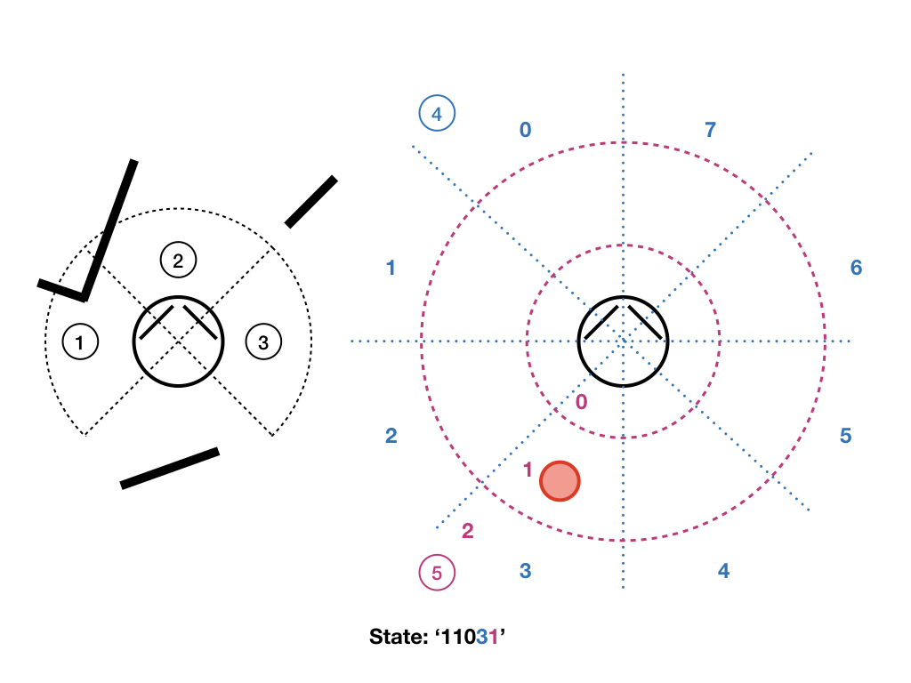

# TME-NavigationStrategies

## Context

This practical requires the installation of [pyfastsim](https://github.com/alexendy/pyfastsim), the python interface of the lightweight simulator [fastsim](https://github.com/jbmouret/libfastsim).

It complements the courses on multiple navigation strategies in animals and robots and reinforcement learning.

## General presentation

The goal of this practical is to test various methods of coordination of navigation strategies, using a simulated robot endowed with two simple strategies, and to quantify their efficiency in an environment where the cooperation of these two strategies is necessary.

The two pre-programmed strategies are:
* A wall following strategy (wallFollower.py), which maintains the robot close to the walls, (too close, it goes away from them, to far, it gets closer), turns around looking for a wall if none is sensed in the vicinity, as well as when it faces an obstacle.
* A beacon approach strategy (radarGuidance.py), which orients the robot towards a beacon whose direction is provided, but does not avoid obstacles.

Each of them can be tested in isolation by running ```python wallFollower.py``` and ```python radarGuidance.py```. The coordination of these two strategies is to be programmed in ```strategyGating.py```, which alreadt contains the code necessary to run the simulation, to load the sensory data, to transform them in a state ID (see below), to teleport the robot when it reaches the goal (and to reward it for doing so), to punish it when it hits a wall, and to repeat the whole process until 40 rewards are collected.

You will have to programm about 40 lines of python. You should write clean and operational code **but** this is not the core of the work (this is not a computer science practical): you are expected to exhibit a scientific approach towards the proposed question. This means: measure the phenomena, with, as much as possible, enough repetitions so as to be able to extract the general tendency, and the dispersion around this tendency, to quantify these so as to be able to make comparisons, to represent the data gathered in a readable manner, to analyze and comment these results.

## Technical information

You have to write code in the ```strategyGating``` function of file ```strategyGating.py```, in order to implement the arbitration methods required by the exercises, and also possibly in the ```main``` function in order to store data at the end of an experiment. Each arbitration method has to signal the chosen strategy by putting either ```0``` (wall follower) or ```1``` (beacon approach) in the ```choice``` variable.

When an experiment is finished (```nbTrials``` have been made), the duration of each trial is stored in a file named ```log/time-TrialDuration-method.txt``` (do not forget to create a ```log/``` directory).

## Problem description


The environment is made of a square arena (600x600 pixels) containing an obstacle and the goal. This goal is associated to a beacon in fastsim, so that its direction can be sensed by the robot using a radar sensor, even through walls.

The robot has the following sensors:
- a laser telemeter with a 200 degree opening angle, providing a measurement every degree.
- right and left bumpers.
- a radar able to sense the direction of the beacon in one of the 8 sectors around the robot.
- a distance sensor roughly measuring the distance of the beacon (0: near, 1: median, 2: far) is simulated using the position of the robot provided by the simulator.

The robot always starts from the (300,35) position.

The U shape obstacle will trap a robot using only the beacon approach strategy.
Similarly, the wall follower will either make the robot turn around the arena wall, or around the obstacle, without ever reaching the goal. It is thus necessary to coordinate these two strategies so as to solve the task in areasonnable time.

The ```strategyGating.py``` programm is designed so that when the robot reaches the goal, it is teleported to its starting position. This teleportation corresponds to the end of a trial, the programm stops when the number of trials reaches the nbTrials value (40), that you can modify depending on your needs. Every time the robot reaches the goal, the reward variable ```rew``` is set to 1, and every time it hits a wall, it is set to -1. **It has to be reset to 0 by the arbitration method you will programm, when this piece of information has been processed.**

## Exercices

Plan to send me an email at the end of the practical containing your version of ```strategyGating.py```, the log files containing the required data (length of the trials, Q-values), and a pdf with your answers to the questions, and indicating your names.

1. If you launch the programm with the existing ```random``` arbitration method, you will see that choosing uniformly between the two strategies at each iteration has almost no chance to drive the robot out of the trap. Write a first arbitration method, ```randomPersist```, that will choose one of the two strategies with equal probabilities, but with a choice that persists for two seconds. This increased stability of the choice should allow the robot to leave the trap (it may still take some time).

2. Run 20 trials with this new strategy, and store the ```XXX-TrialDurations-YYY``` file that contains the duration of each of these trials. Compute the median, the first and third quartiles of these durations. This data will constitute a reference: any *intelligent* method should manage to do better that this blind approach. *To do so, you can use the percentile function of numpy.*

**Pro-tip :** While these 20 trials are going on, rather than staring at the moving robot, begin the next question.

3. Programm a ```qlearning``` arbitration method similar to the one used in (Dollé et al., 2010): it uses a Q learning algorithm to learn, trial after trial, which strategy is the most adapted given the perceived state.



**Definition of states:** We will use a simple tabular approach, the states can take a limited number of discrete values, they are identified by a string built as follows: the first three characters (0 or 1) indicate if there is a wall on the right, the middle or the left; the next character, between 0 and 7, indicates the direction of the beacon; the last one (0, 1 or 2) indicates whether the beacon is near (<125 pixels), at a median distance (<250 pixels) or far way (>= 250 pixels). These states are already built by the provided programm (using the ```buildStateFromSensors```) function, the current state can be read in the ```S_t``` variable, the previous one in ```S_tm1```.

**Q-Learning :** You have to create and update the value Q(s,a) of the encountered couples (état,action), and use it every time you need to choose the next active navigation strategy. *You may proceed as you wish, but I suggest you to use a dictionnary to store these Q-values, to start with an empty dictionnary, and to incrementally add to this dictionnary the new states the robot encounter.*
To do so, you will have to compute at every timestep the reward prediction error:


Then update the Q-value corresponding to the last chosen action:


The action selection is then performed by sampling in a softmax probability distribution obtained from the Q-values of the current state:


Use the following parameters: ```alpha=0.4```, ```beta=4```, ```gamma=0.95```.

In our specific case, actions are continuous and take an undefined time. Doing updates of the Q-values at each time step doesn't make sense: in 10ms the sensory state won't change much, and thus the reward signals generated by the goal or the walls will dilute very rapidly, unless you use a ```gamma``` parameter very close to 1. We could consider updating the Q-values only when the state changes (an indicator that the current action has resulted in a change) or when a reward signal is received, but doing only that could result in situations where the current action doesn't generate a change, and the robot keeps executing it undefinitely. To avoid that we will also use a timeout of 2s maximum, i.e. if no change has been perceived in the last two seconds, the action will still be considered finished, a Q-value update will be done, and a new action selected.

So you will have to modify the basic algorithm as follows:
* make an update of Q(s,a) whan the state has just changed, when there was a choice at the previous timestep, or when the reward is not zero.
* select a new action when the state just changed, when the reward is not zero, or when there has been no new choice in the last 2 seconds.

4. To estimate the efficiency of this Q-learning, repeat at least 4 experiments lasting 40 trials each, when the first one is finished, go to next step (and let the 3 other run).

5. Use the data generated by the first experiment of question 4 to look at the Q-values at the end of the experiment. What are the Q-values of states ```00002``` and ```00072```? ```00000``` and ```00070```? ```11101``` and ```11171```? Are these values, for each of the strategies, as one could expect?

6. When all the experiments of question 4. are finished:
* generate a figure representing the duration of the trials for each experiment (one curve for each experiment, all on the same graph). Comment it.
* measure the median and the quartiles of the durations of the first 10 trials of each experiment (all together, i.e. on 40 trials), the same for the last 10 trials. Is there an improvement of the performance? How does the measure done for the last trials compare to the reference computed at question 2? Is the Q-learning getting better after 40 trials?

Do not forget to send me an email containing your version of ```strategyGating.py```, the log files containing the required data (length of the trials, Q-values), and a pdf with your answers to the questions, and indicating your names.
